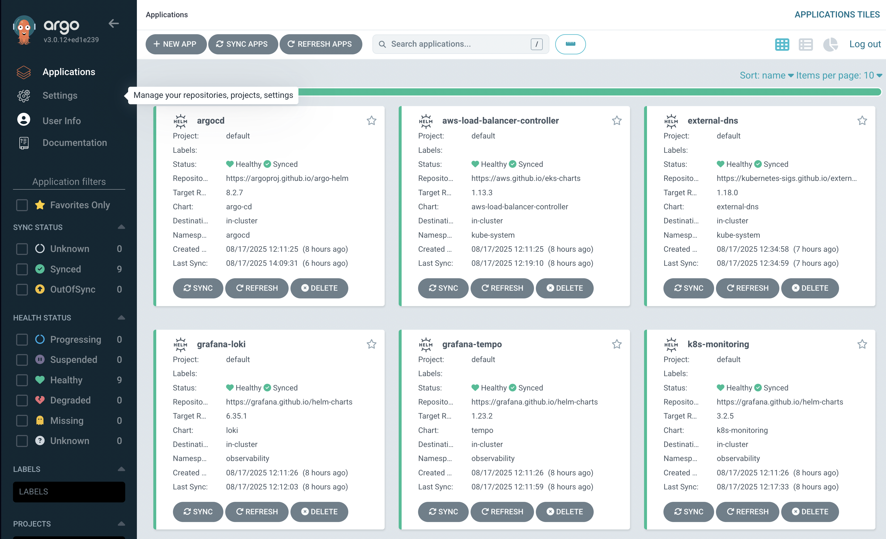
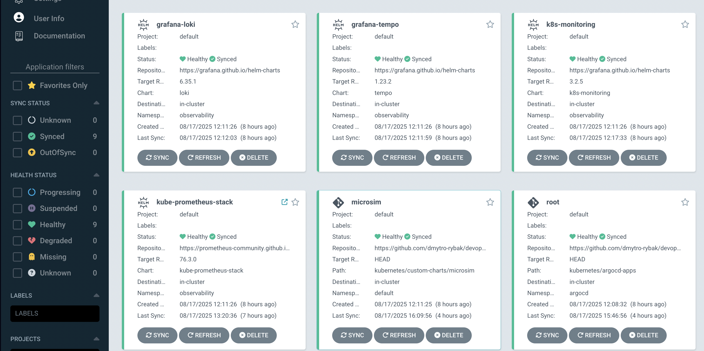
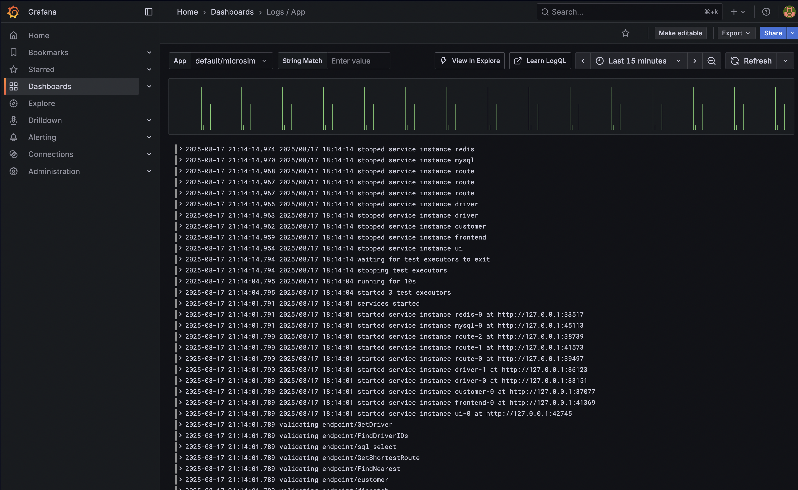
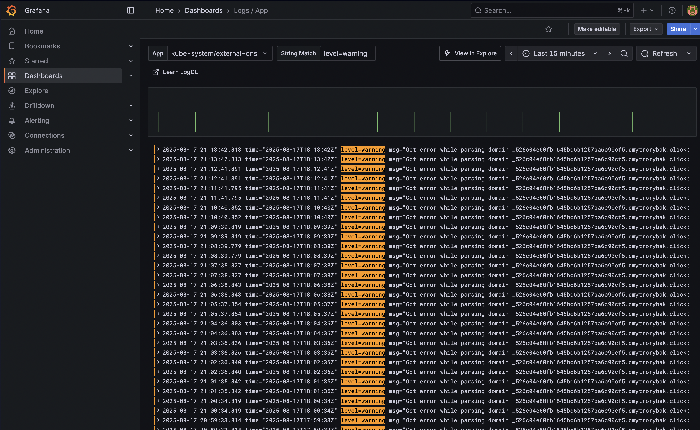
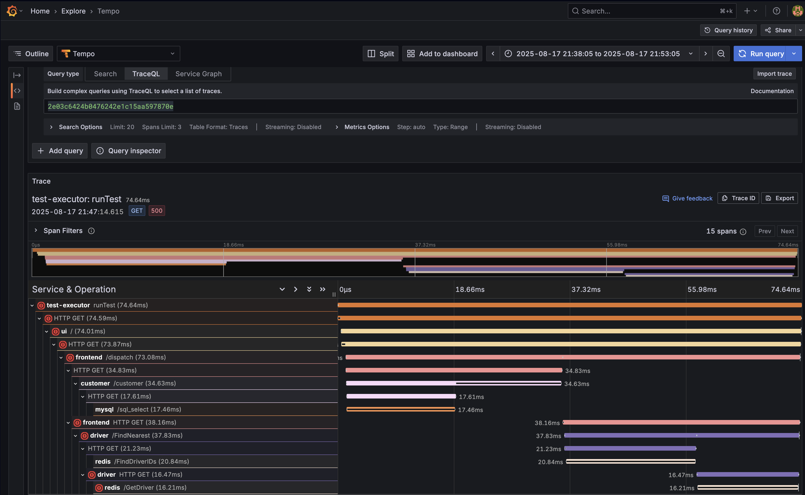
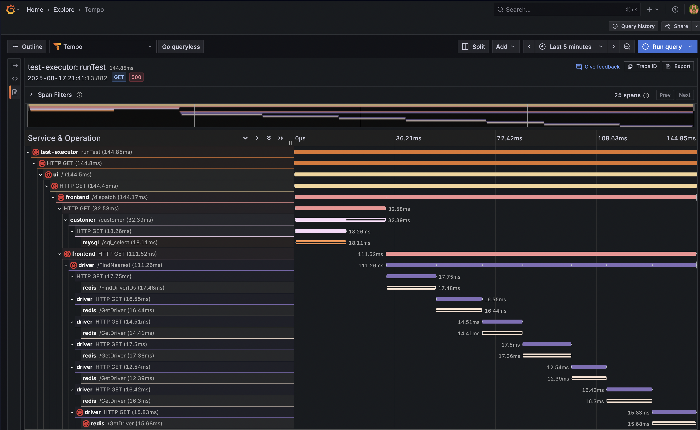
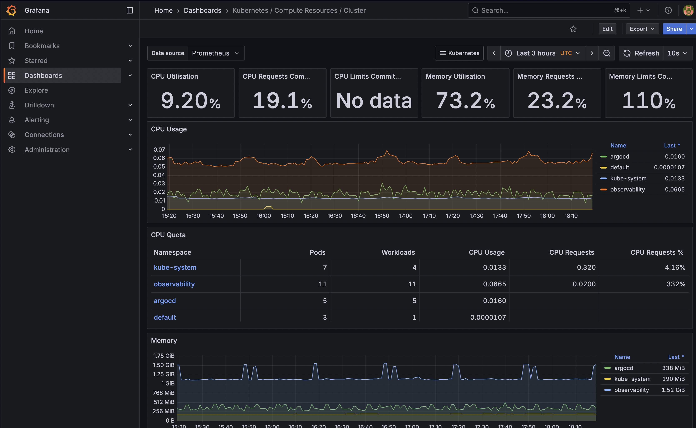
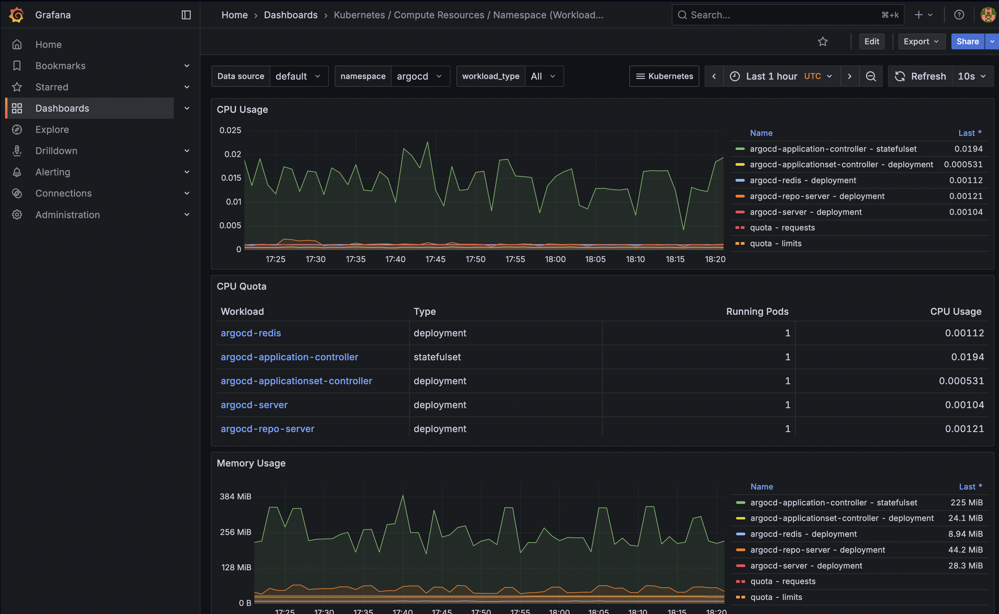

# DevOps Engineer Assignment

This project demonstrates a complete DevOps engineering solution featuring AWS infrastructure provisioning with Terraform, Kubernetes management using GitOps approach, and Observability stack (Prometheus, Grafana, Loki, Tempo). The project deploys and manages the **Microsim** application - a microservices simulator that generates realistic distributed tracing data.

## Links

- [Microsim Application](https://github.com/yurishkuro/microsim)
- [Grafana Dashboard](https://grafana.dmytrorybak.click)

## Infrastructure

The AWS infrastructure is designed to be production-ready, cost-effective, and easily extensible for multiple environments while maintaining security best practices and operational efficiency.

**Infrastructure as Code**
- Almost all infrastructure is deployed through Terraform code except custom domain registration and S3 bucket for Terraform backend
- Modular Terraform structure
- Version-controlled infrastructure changes with proper state management

**Security and Access Management**
- AWS IAM Identity Center integration for secure local development access
- Temporary credentials approach eliminates static access keys
- IAM Roles for Service Accounts (IRSA) provides secure AWS service integration from Kubernetes
- ACM certificate for HTTPS termination

**EKS Cluster Configuration**
- EKS cluster deployed in public subnets to avoid NAT Gateway costs (only for this assignment)
- EKS Auto Mode with Karpenter for dynamic node provisioning
- No static long-lived nodes, on-demand resource allocation based on actual workload requirements
- Proper security group configurations for controlled access
- ALB controller for load balancing and ingress traffic management
- Route53 DNS automation with external-dns controller

**Object Storage**
- Dedicated S3 buckets for Loki (logs) and Tempo (traces) data
- Server-side encryption with AES-256
- Public access blocking and bucket policies for security
- Reliable, scalable storage for observability data retention

## Kubernetes and GitOps

This project implements a GitOps-first approach using ArgoCD for declarative, automated application deployment and management. The platform leverages modern Kubernetes patterns and industry-standard observability tools to create a comprehensive monitoring and tracing solution.

**GitOps Approach**
- Root Application (`app-of-apps.yaml`) manages all child applications declaratively
- ArgoCD monitors the GitHub repository and automatically syncs changes
- Self-managing ArgoCD installation through its own Application resource
- Automated pruning and self-healing for configuration drift prevention
- Applications and ApplicationSets for third-party services and custom charts

**AWS Load Balancer Controller**
- Automatically provisions AWS Application Load Balancer based on Kubernetes Ingress resources
- AWS ACM auto-discovery and integration with ALB
- Advanced routing capabilities with path-based and host-based rules

**External DNS Automation**
- Automatic Route53 DNS record management based on Ingress host configurations
- Eliminates manual DNS management overhead

**Microsim Application**
- Deployed as Helm custom chart for flexible configuration management
- CronJob executing every minute for consistent trace generation
- Automatic integration with Grafana Tempo for telemetry export

## Observability

**Logging**
- Grafana Loki for centralized log aggregation and storage
- Grafana Alloy for log collection across the cluster
- S3-backed storage for log retention and cost optimization
- Structured logging with label-based querying capabilities

**Tracing**
- Grafana Tempo for OpenTelemetry trace collection and analysis
- S3 backend for trace storage and long-term retention

**Metrics & Visualization**
- Kube-Prometheus Stack for comprehensive Kubernetes monitoring
- Prometheus for metrics collection from cluster and applications
- Grafana as unified visualization platform for all observability data
- Pre-configured dashboards and alerting rules
- Multi-datasource integration (Prometheus, Loki, Tempo)

